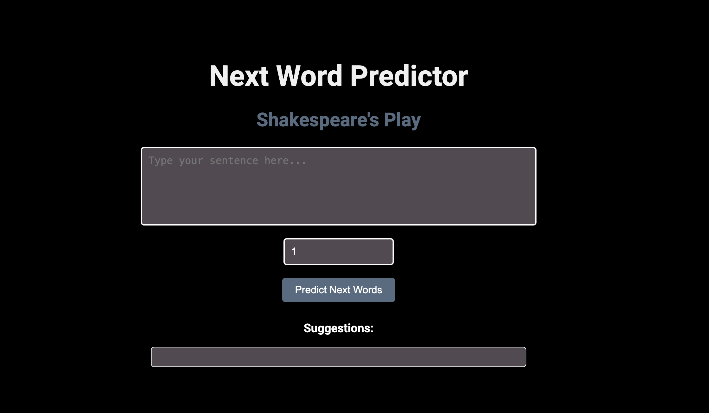

# Shakespeare Text Generation using LSTM
## A. Dataset
  The dataset used is the Shakespeare Plays dataset, containing the complete works of William Shakespeare. Each row represents a unique dialogue or text from the plays, making it ideal for NLP tasks like word or sentence completion.

## B. Pre-processing
- Loading: The dataset was loaded as a text corpus and concatenated into a single string.
- Tokenization: Text was tokenized into sequences of integers, where each word was assigned a number.
- Sequence Generation: N-grams were generated, with input sequences and target labels.
- Padding: Sequences were padded to ensure uniform length.
- Train-Test Split: The data was split into training and testing sets.
## C. Model Architecture
- Embedding Layer: Converts word sequences into dense vectors.
- LSTM Layer: Processes word sequences while retaining context over long distances.
- Dense Layer: Fully connected layer with softmax activation for next-word prediction.
- Loss: Categorical cross-entropy was used as the loss function.
- Optimizer: The Adam optimizer was applied for training.
## D. Training Performance
- Epoch 1: Accuracy: 3.05%, Loss: 7.06
- Epoch 25: Accuracy: 58.11%, Loss: 1.97
- Epoch 50: Accuracy: 73.66%, Loss: 1.18
## E. Example Output
- Input: "Long live the"
- Prediction: "Long live the King and."

